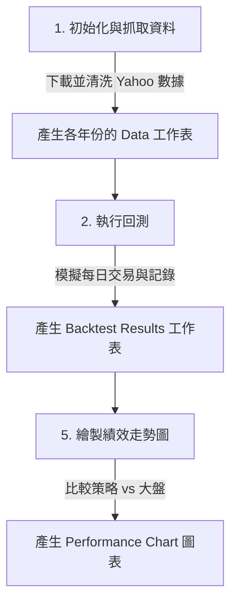

# 📈 Google Apps Script 量化回測系統 (GAS Quant Backtest)

本專案是一個基於 **Google Apps Script (GAS)** 與 **Google Sheets** 的自動化量化交易回測與資產再平衡系統。系統整合了 **Yahoo Finance API** 自動抓取歷史數據，並具備防禦機制（VIX / MDD）、不虧損鎖倉保護、趨勢/跳空濾網以及動態強弱勢評分系統。

對於第一次接觸本專案的人，這份指南將引導您在 **5 分鐘內**完成部署並開始運行回測。

---

## 🚀 快速上手教學 (Quick Start)

您可以使用兩種方式部署此系統：**瀏覽器直接貼上**（適合一般使用者）或 **Clasp 本地部署**（適合開發者）。

### 方法 A：直接在瀏覽器部署（最簡單）

1. **建立新的試算表**：
   * 前往 [Google Sheets](https://sheets.google.com/) 建立一份新的空白試算表。

2. **開啟 Apps Script 編輯器**：
   * 在試算表上方選單點選 **「擴充功能」 (Extensions) ➔ 「Apps Script」**。

3. **複製程式碼**：
   * 將本專案中的所有 `.gs` 檔案與 `appsscript.json` 的內容，分別在 Apps Script 編輯器中建立同名檔案並貼上：
     * `Code.gs`
     * `Constants.gs`
     * `MarketDataFetcher.gs`
     * `RebalanceController.gs`
     * `FilterEngine.gs`
     * `ScoringEngine.gs`
     * `PortfolioManager.gs`
     * `RebalanceExecutor.gs`
     * `RebalanceCalculator.gs`
     * `Analysis.gs`
     * `DailyLogger.gs`
     * `Notifier.gs`
     * `Utils.gs`
     * `DebugDate.gs`
     * `Logger.gs`
   * *提示：若找不到 `appsscript.json`，請在 Apps Script 專案設定中勾選「在編輯器中顯示 appsscript.json 資訊清單檔案」。*

4. **儲存並重新整理試算表**：
   * 在 Apps Script 編輯器點選 **「儲存」 (Save)**。
   * 返回 Google 試算表網頁並 **重新整理 (F5)**。
   * 您會看到上方選單列多出一個自定義選單：**`量化回測系統`**。

---

### 方法 B：使用 clasp 命令列部署（適合開發者）

如果您在電腦本機開發，可使用 Google 官方的 `clasp` 工具進行同步：

1. **啟用 Google Apps Script API**：
   * 請前往 [Google Apps Script 官方設定網頁](https://script.google.com/home/usersettings) 並將 **「Google Apps Script API」** 設定為 **啟用 (ON)**。

2. **本機環境設定**（PowerShell / Terminal）：
   ```bash
   # 允許執行 PowerShell 腳本 (Windows)
   Set-ExecutionPolicy RemoteSigned -Scope CurrentUser

   # 登入您的 Google 帳號
   npx @google/clasp login
   ```

3. **建立或綁定現有專案**：
   ```bash
   # 綁定您已建立的 GAS 專案 (Script ID 可在 GAS 專案設定中取得)
   # 或者直接使用專案目錄下的 .clasp.json，修改裡面的 scriptId 即可。
   
   # 推送程式碼到雲端
   npx @google/clasp push
   ```

---

## 🛠️ 系統操作指南 (How to Run)

重新整理試算表後，點選上方自定義選單 **`量化回測系統`**，依序執行以下步驟：



### 1. 抓取歷史數據
* 點選 **`量化回測系統` ➔ `1. 初始化與抓取資料`**。
* **首次執行時，Google 會要求授權（Authorization Required）**：
  * 點選「繼續」 ➔ 選擇您的 Google 帳戶 ➔ 點選「進階」 (Advanced) ➔ 點選「前往量化回測系統 (不安全)」 ➔ 點選「允許」。
* 授權完成後，再次點選該選單。系統將自動從 Yahoo Finance 抓取設定的 ETF 歷史價格，並按年度分頁寫入（例如 `2023Data`, `2024Data`）。

### 2. 執行策略回測
* 點選 **`量化回測系統` ➔ `2. 執行回測`**。
* 系統將開始模擬從 `START_DATE` 開始的每日淨值與每月再平衡邏輯。
* 回測完成後，將會自動產生 `Backtest Results` 工作表，詳細記錄每一天的持倉、操作、YTD 績效以及交易摩擦成本。

### 3. 生成績效圖表
* 點選 **`量化回測系統` ➔ `5. 繪製績效走勢圖`**。
* 系統會自動反推大盤淨值並新增一個 `Performance Chart` 工作表，繪製出一張 **策略績效 vs SPY 大盤績效** 的對比折線圖，讓您一目了然策略是否跑贏大盤。

### 4. 實機再平衡計算器 (Rebalance Calculator)
* 點選 **`量化回測系統` ➔ `7. rebalanceCal`**。
* 系統會自動建立 `Rebalance Calculator` 工作表。
* 填入您的「總投資資金」與「各標的目前持股量/目標比例」，系統會自動連網抓取最新價格，並直接給出 **買入/賣出股數** 的具體交易建議。

---

## ⚙️ 策略參數調整 (`Constants.gs`)

您可以開啟 [Constants.gs](file:///d:/Users/keith/project/quant_backtest_gas/Constants.gs) 自行客製化策略參數。修改後存檔，重新執行回測即可套用：

* **初始資金與標的**：
  ```javascript
  INITIAL_CAPITAL: 10000,
  TICKERS: ['SPMO', 'XLE', 'VDC', 'VCR'], // 投資組合標的
  BENCHMARK: 'SPY', // 比較基準大盤
  START_DATE: '2010-06-29', // 回測開始日期
  ```
* **危機防禦設定 (Crisis Mode)**：
  ```javascript
  CRISIS_CONFIG: {
    VIX_THRESHOLD: 25,  // 當 VIX 波動率大於此值時觸發避險
    MDD_THRESHOLD: 0.07, // 或是 5 日內最大回撤大於 7% 觸發避險
    WEIGHTS: { SPMO: 0, XLE: 0, VDC: 0, VCR: 0 } // 避險時 100% 持有現金 / SGOV
  }
  ```
* **不虧損鎖倉原則 (No-Loss Selling Lock)**：
  * 當再平衡時，若某檔持股當前價格 **低於您的加權平均持股成本**，系統會強制將該標的的再平衡目標權重設為當前持倉比例（不進行賣出），避免在低檔實現虧損。
* **通知信件設定**：
  ```javascript
  NOTIFICATION_EMAIL: '您的信箱@gmail.com',
  ```
  * 回測完成或觸發再平衡訊號時，系統會自動寄送精美的 HTML 績效與持倉報告至該信箱。

---

## ⏰ 設定每日自動排程 (Automation)

如果您希望本系統每天自動更新數據並在交易前發送通知郵件，可以設定 GAS 時間觸發器：

1. 在 Apps Script 編輯器左側選單點選 **「觸發條件」 (Triggers, 鬧鐘圖示)**。
2. 點選右下角 **「新增觸發條件」 (Add Trigger)**。
3. **設定第一個觸發器（更新數據）**：
   * 選擇要執行的函式：`setupAndFetchData`
   * 選擇事件來源：`時間驅動`
   * 選擇時間型觸發條件類型：`日計時器`
   * 選擇時段：`上午 3 時至 4 時` (美股收盤後，確保獲取當日最新數據)
4. **設定第二個觸發器（執行回測與發送通知）**：
   * 選擇要執行的函式：`runBacktest`
   * 選擇事件來源：`時間驅動`
   * 選擇時間型觸發條件類型：`日計時器`
   * 選擇時段：`上午 4 時至 5 時` (確保數據更新完成後再行計算)

---

## 📂 檔案架構說明

* [Code.gs](file:///d:/Users/keith/project/quant_backtest_gas/Code.gs)：自定義選單入口與按鈕事件處理。
* [Constants.gs](file:///d:/Users/keith/project/quant_backtest_gas/Constants.gs)：全域設定檔（權重、閾值、Email等）。
* [MarketDataFetcher.gs](file:///d:/Users/keith/project/quant_backtest_gas/MarketDataFetcher.gs)：對接 Yahoo Finance 下載 CSV 並對資料進行回填清洗。
* [RebalanceController.gs](file:///d:/Users/keith/project/quant_backtest_gas/RebalanceController.gs)：多層級量化策略核心控制器（控制危機、鎖倉與再平衡）。
* [FilterEngine.gs](file:///d:/Users/keith/project/quant_backtest_gas/FilterEngine.gs)：危機、趨勢、跳空狀態過濾器。
* [ScoringEngine.gs](file:///d:/Users/keith/project/quant_backtest_gas/ScoringEngine.gs)：計算個股 1M/3M/Sharpe/Alpha 動態綜合評分。
* [PortfolioManager.gs](file:///d:/Users/keith/project/quant_backtest_gas/PortfolioManager.gs)：虛擬交易帳戶，管理現金、股數與持股成本。
* [RebalanceExecutor.gs](file:///d:/Users/keith/project/quant_backtest_gas/RebalanceExecutor.gs)：執行具體買賣撮合，並精確扣除手續費與稅金滑點。
* [RebalanceCalculator.gs](file:///d:/Users/keith/project/quant_backtest_gas/RebalanceCalculator.gs)：提供日常手動資產配置的即時計算工具。
* [Analysis.gs](file:///d:/Users/keith/project/quant_backtest_gas/Analysis.gs)：報表生成與 Google Sheet 折線圖繪製。
* [DailyLogger.gs](file:///d:/Users/keith/project/quant_backtest_gas/DailyLogger.gs)：批次寫入優化，解決 GAS 執行時間限制的持久化記錄器。
* [Utils.gs](file:///d:/Users/keith/project/quant_backtest_gas/Utils.gs)：均線、夏普值、相關係數與 Beta 等純數學計算函式。